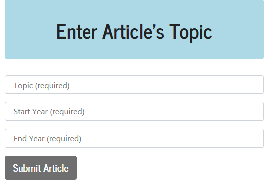
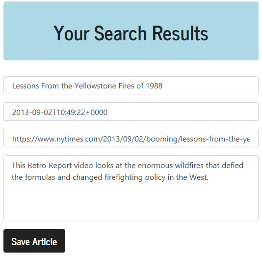
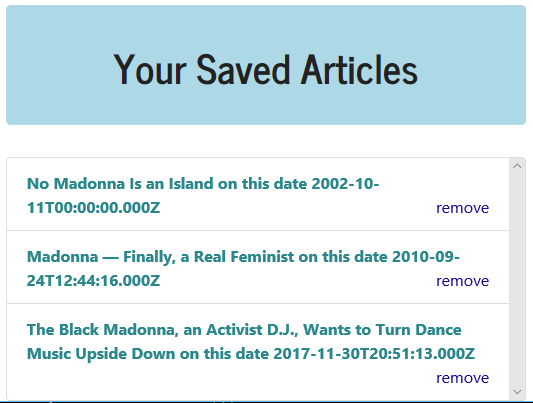

# New York Times ReactJS App 

A `ReactJS`, `NodeJS`, `MongoDB` and `Express applications will help the users to query, display, save and remove articles from the [New York Times Article Search API](http://developer.nytimes.com/).

Please check the app in Heroku [here](https://)

## Functionality

On the frontend, the app uses `ReactJS` for rendering components, `axios` for internal/external API calls, and `bootstrap` as a styling framework.

The app uses `express` to serve routes and `mongoose` to interact with a `MongoDB` database on the back end.

## If you wish to clone the app 

Start by installing front and backend dependencies. While in this directory, run the following commands:

yarn install
cd client
yarn install
cd ..
``

After both installations complete, run the following command in your terminal:

yarn start

Your app should be running on <http://localhost:3000>. The Express server should intercept any AJAX requests from the client.

## User Flow

#### 1. Users can submit a topic, start year, and end year to query the New York Times

#### 2. Users can save the topic they like

#### 3. Users can delete the topic or press on a topic to get URL

#### 4. Users can get article's URL

